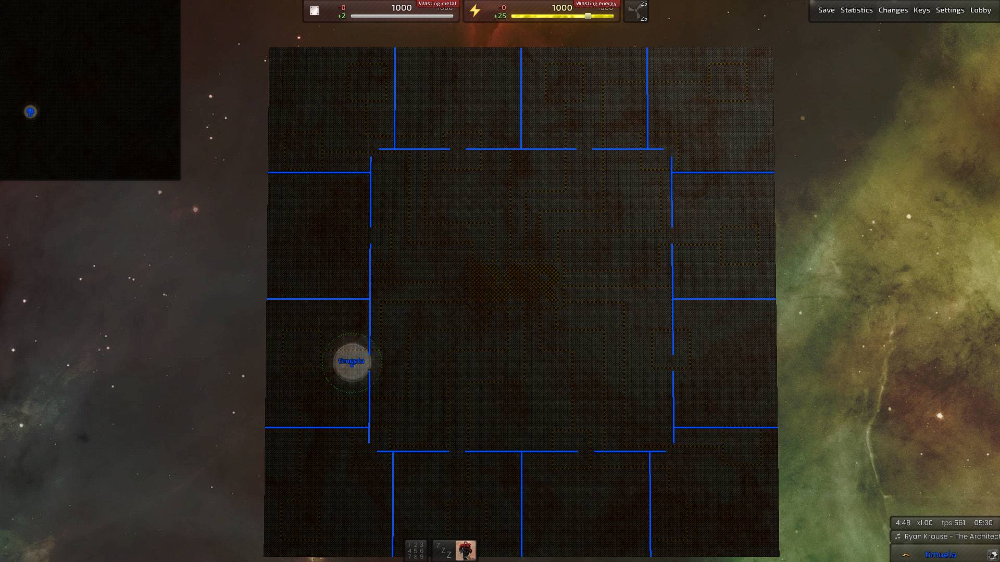
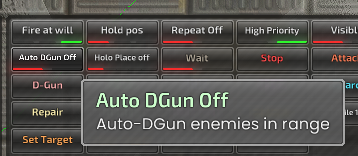
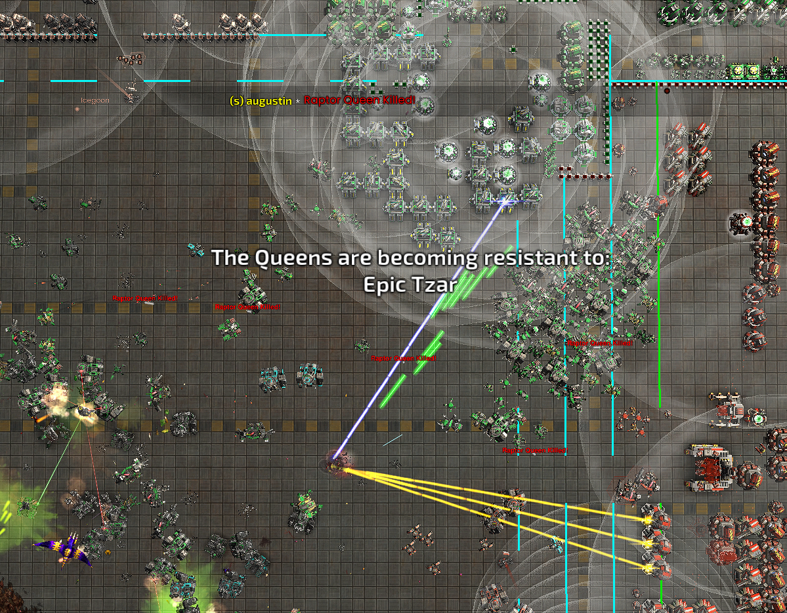

# Auto Draw a Grid for NuttyB Raptor

When ingame press F11 then scroll to the bottom to turn on then turn off, the widget will draw automatically, there's no shortcut or key.

It will check if you're playing Full Metal Plate map or not.

[Download Auto Draw Grid](https://github.com/timuela/BAR-widgets/blob/main/auto_draw_grid.lua)

# Added more options to Holo Place

Automatically place the next building in your build queue once the current structure reaches a defined completion threshold. This helps maintain building momentum by minimizing idle time as the construction unit walks between placement locations.

You can configure when the next placement should trigger using the following options:

Ins: Instant

30: When 30% of the current building is completed

60: When 60% of the current building is completed

90: When 90% of the current building is completed

Credit to original author: manshanko

[Download Holo Place (Default version, will force a turret to assist, if no available turrets, it'll pause)](https://github.com/timuela/BAR-widgets/blob/main/holo_place.lua)

[Download Holo Place (No-hijacking version, ignore turrets requirement.)](https://github.com/timuela/BAR-widgets/blob/main/holo_place_no_hijacking.lua)

# Auto Dgun for nuttyb raptor

**What it does**

- Makes your commander auto-DGun dangerous enemies in range (600)

**Targets**

- Raptor Queens
- Penguin
- Mini-queens
- Matrona (basic, fire, electric, acid)
- Doom Bringers.

**Features**

- Toggle Auto DGun On/Off in the command menu
- Works only with commanders
- Checks every 0.5s
- Console feedback when commander fires

**Cons**

- Fires at the position, not the target → if Repeat is ON, your commander may keep DGunning even after the target is dead
- Will not discriminate → your neighbor’s units could get fried if they’re in the way

[Download Auto DGun](https://github.com/timuela/BAR-widgets/blob/main/auto_dgun.lua)

# Queen Ping for nuttyb raptor

**What it does**

- Automatically **pings the map** when a **Raptor Queen dies**
- Shows a **red marker** with the text: _“Raptor Queen Killed!”_

**Targets**

- **Raptor Queens**

**Features**

- Clear **visual ping** at the exact death location
- Helps your team **know how many queens was killed at your doorstep**

**Why use it?**

- Clout farming "**Yay i killed 4 queens**"

[Download Queen Ping](https://github.com/timuela/BAR-widgets/blob/main/queen_ping.lua)

